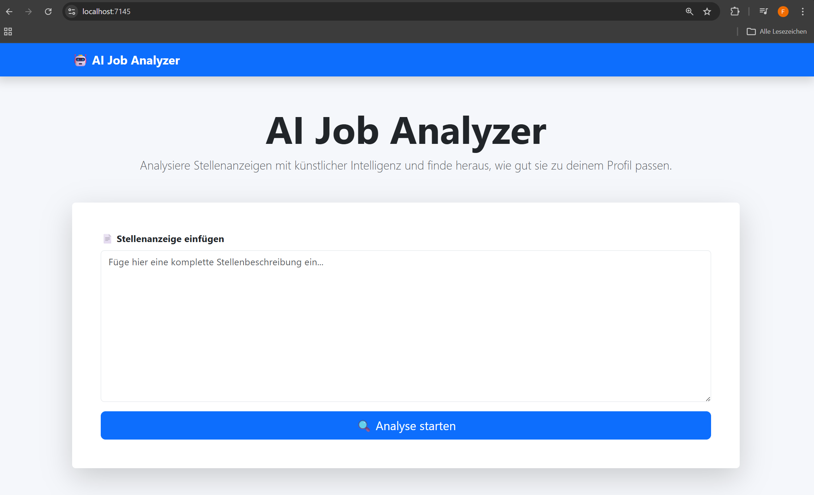

# AI Job Analyzer

Eine ASP.NET Core MVC Web-App, die Stellenanzeigen analysiert und strukturiert zusammenfasst.

Das Projekt demonstriert, wie eine externe AI-API professionell in eine moderne .NET Webanwendung integriert wird.

---

## Features

- Analyse von Stellenanzeigen mit künstlicher Intelligenz
- Strukturierte Ausgabe:
  - Zusammenfassung
  - Wichtige Skills
  - Match Score
  - Bewerbungstipps
- Moderne ASP.NET MVC Architektur
- API-Integration über HttpClient (REST)
- Fehler- und Rate-Limit-Handling
- Demo-Fallback bei API-Problemen
- Benutzerfreundliches UI mit Bootstrap

---

## Technologien

- C#
- ASP.NET Core MVC (.NET 8)
- OpenAI API
- HttpClient / REST Integration
- Dependency Injection
- Bootstrap

---

## Architektur

Die Anwendung folgt einer klassischen MVC-Struktur:

Controller → verarbeitet Requests  
Service → enthält AI-Logik und API-Integration  
ViewModel → Datenübertragung  
View → UI Darstellung  

---

## Verwendung

1. Projekt starten
2. Auf der Startseite eine Stellenanzeige einfügen
3. Analyse anzeigen lassen

Falls das API-Limit erreicht ist, wird automatisch ein Demo-Ergebnis angezeigt.

---

## Screenshot

---

## Autor

Fabio Fartek Junior .NET Developer mit Fokus auf C#, ASP.NET und AI-Integration.
